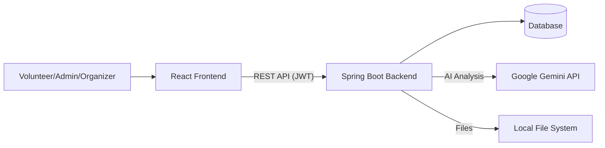

# Volunteer Hub - Project Documentation

Welcome to the comprehensive documentation for **Volunteer Hub (VMS)**, a modern platform designed to bridge the gap between volunteers and community service organizers.

## 🚀 Project Overview

**Volunteer Hub** is a full-stack web application that facilitates the organization, management, and participation in volunteer events. It features a robust multi-role system (Admin, Organizer, Volunteer) to ensure streamlined operations from document verification to certificate issuance.

---

## 🛠 Tech Stack

### Backend
- **Framework**: Spring Boot 3.x (Java)
- **Security**: Spring Security with JWT (Stateless)
- **Database**: PostgreSQL (`volunteerdb`)
- **AI Integration**: Spring AI with Google Gemini API (`gemini-2.5-flash`)
- **File Storage**: Local filesystem-based document storage
- **Logging**: SLF4J / Logback

### Frontend
- **Framework**: React.js (Vite)
- **Styling**: Vanilla CSS + TailwindCSS (Glassmorphism & Modern UI)
- **State Management**: React Hooks (State, Effect, Memo)
- **Icons**: Lucide React
- **Routing**: React Router DOM

---

## 🏗 System Architecture

The project follows a decoupled client-server architecture:

1.  **Frontend (Client)**: A highly interactive SPA (Single Page Application) that communicates with the backend via RESTful APIs.
2.  **Backend (API Server)**: A Spring Boot service handling business logic, security, and persistence.
3.  **Communication**: Secured via JWT tokens passed in HTTP headers.

---

## 🌟 Core Modules

### 1. Authentication & Role Management
- **JWT Security**: Secure, stateless authentication.
- **Role-Based Access Control (RBAC)**:
    - **Volunteer**: Browser events, join requests, download certificates.
    - **Organizer**: Create/Manage events, track attendance.
    - **Admin**: Verify user documents, manage platform health.

### 2. Document Verification (Admin)
- **Integrated Preview**: Side-by-side layout to view and verify documents (PDF/Images) without leaving the page.
- **Workflow**: Automated status updates (Pending → Verified/Rejected).

### 3. Event Management (Organizer & Volunteer)
- **Dynamic Events**: Countdown timers, registration windows, and capacity limits.
- **Joining Flow**: Volunteers can join events (even with pending verification) to encourage participation.
- **Feedback & Certificates**: Automated certificate generation for completed missions.

### 4. Notification System
- **Global Alerts**: Real-time (in-app) notifications for essential activities (event creation, join status, etc.).
- **Persistence**: Notifications are stored and can be marked as read.

---

## 🔑 Key API Endpoints (Pre-alpha)

| Endpoint | Method | Description |
| :--- | :--- | :--- |
| `/api/auth/login` | `POST` | User authentication & JWT issuance |
| `/api/documents` | `GET` | List documents for verification (Admin) |
| `/api/documents/{id}/verify` | `PUT` | Approve or reject a document |
| `/api/events` | `GET` | Browse available volunteer missions |
| `/api/notifications` | `GET` | Retrieve in-app notifications |

---

## ⚙️ Setup & Installation

### Prerequisites
- JDK 17+
- Node.js 18+
- Maven

### Backend Setup
1. Navigate to `/backend/Volunteer-Hub`.
2. Configure `src/main/resources/application.properties` (Database & AI keys).
3. Run `mvn spring-boot:run`.

### Frontend Setup
1. Navigate to `/vms-frontend`.
2. Run `npm install`.
3. Run `npm run dev`.
4. Access the app at `http://localhost:5173`.

---

> [!NOTE]
> This project is under active development. Ensure `X-Frame-Options` is disabled in the backend to support the integrated document preview feature.
